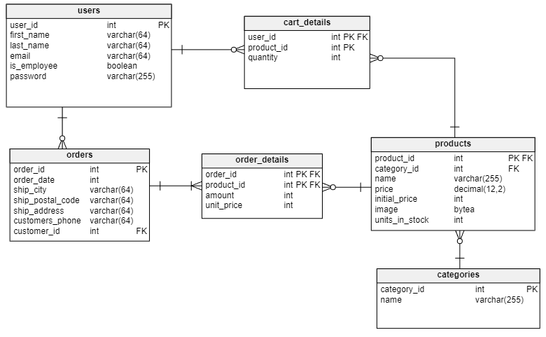

# Dokumentacja bazy danych

**Skład grupy:** Krzysztof Gołuchowski i Krystian Sienkiewicz

**Temat:** Prosty sklep internetowy z suplementami dla sportowców

**SZBD:** PostgreSQL

**Technologia:** Java/Hibernate

### Database diagram
 


### Data Model

>Users table

```java
public class User {
    @Id
    @GeneratedValue(strategy = GenerationType.IDENTITY)
    @Column(name = "user_id")
    private Long id;

    @Column(name = "first_name")
    private String firstName;

    @Column(name = "last_name")
    private String lastName;

    @Column(name = "email")
    private String email;

    @Column(name = "is_employee")
    private Boolean isEmployee;

    @Column(name = "password")
    private String password;
}
```

>Products table

```java
public class Product {
    @Id
    @GeneratedValue(strategy = GenerationType.IDENTITY)
    @Column(name = "product_id")
    private Long id;

    @ManyToOne
    @JoinColumn(name = "category_id", referencedColumnName = "category_id")
    private Category category;

    @Column(name = "name")
    private String name;

    @Column(name = "price")
    private double price;

    @Column(name = "initial_price")
    private double initialPrice;

    @Column(name = "image")
    private byte[] image;

    @Column(name = "units_in_stock")
    private int unitsInStock;

    public void removeUnitsInStock(int quantity) {
        unitsInStock -= quantity;
    }
}
```

>Order table

```java
public class Order {
    @Id
    @GeneratedValue(strategy = GenerationType.IDENTITY)
    @Column(name = "order_id")
    private Long orderId;

    @Column(name = "orderdate")
    private Date orderDate;

    @Column(name = "shipcity")
    private String shipCity;

    @Column(name = "shippostalcode")
    private String shipPostalCode;

    @Column(name = "shipaddress")
    private String  shipAddress;

    @Column(name = "customersphone")
    private String  customersPhone;

    @ManyToOne
    @JoinColumn(name = "customer_id", referencedColumnName = "user_id")
    private User customer;
}
```

>Order Details table

```java
public class Order {
    @Id
    @GeneratedValue(strategy = GenerationType.IDENTITY)
    @Column(name = "order_id")
    private Long orderId;

    @Column(name = "orderdate")
    private Date orderDate;

    @Column(name = "shipcity")
    private String shipCity;

    @Column(name = "shippostalcode")
    private String shipPostalCode;

    @Column(name = "shipaddress")
    private String  shipAddress;

    @Column(name = "customersphone")
    private String  customersPhone;

    @Column(name = "customer_id")
    private Long customerId;
}
```

>Category table

```java
public class Category {
    @Id
    @GeneratedValue(strategy = GenerationType.IDENTITY)
    @Column(name = "category_id")
    private Long id;

    @Column(name = "name")
    private String name;
}
```

>Cart Details table

```java
public class CartDetails {
    @EmbeddedId
    private CartDetailsId cartId;

    @ManyToOne
    @MapsId("userId")
    @JoinColumn(name = "user_id")
    private User user;

    @ManyToOne
    @MapsId("productId")
    @JoinColumn(name = "product_id")
    private Product product;

    @Column(name = "quantity")
    private Integer quantity;

    public void incrementQuantity() {
        quantity++;
    }

    public int decrementQuantity() {
        if (quantity > 0)
            quantity--;
        return quantity;
    }
}
```

>Cart Details Id

```java
@Embeddable

public class CartDetailsId implements Serializable {
    private Long userId;
    private Long productId;
}
```

### Backend endpoints

#### User Controller

---

> Login User – POST „/users/login”

Body:
```
{
    "email": "krzysiu123@gmail.com",
    "password": "siema"
}
```
Result:
```
{
    "isEmployee": true,
    "message": "Zalogowano pomyślnie!",
    "loggedUserId": 2
}
```

W przypadku podania nieprawidłowych danych zwracane jest 
`ResponseEntity.status(HttpStatus.UNAUTHORIZED).body(null);`

>Register User – POST „/users/register”

Body:
```
{
    "firstName": "Krzysztof",
    "lastName": "Goluchowski",
    "email": "krzychu@gmail.com",
    "isEmployee": true,
    "password": "butter123"
}
```
Result:
```
Zarejestrowano pomyslnie
Witaj Krzysztof!
```

#### Product Controller

---

>Create Product – POST „/products/add”

Body:
```
{
    "category_id": "1",
    "name": "Najlepsze białko",
    "price": 100,
    "initial_price": 89.99,
    "image": "Wybrane zdjęcie z komputera"
}
```
Result:
```
DODANO!
```

>Get All Products – GET „/products/all”

Body:
```
{}
```
Result:
```
[
    {
        "id": 4,
        "categoryID": 1,
        "name": "Białko dla studentów",
        "price": 10.99,
        "initialPrice": 10.99,
        "image": "iVBORw0KGgoAAAANSUhEUgAAAS0 …
        "unitsInStock": 2
    },
    … Reszta produktów
]
```

> Delete Product – DELETE „/products/{id}”
> 
Body:
```
{}
```
Result:
```
Product deleted successfully!
```

>Update Product Price – PUT „/products/edit-price/{id}”

Body:
```
{
    "price": 10
}
```
Result:
```
Product updated successfully!
```

#### Order Controller

---

>Place Order – PUT „/orders/place” TODO

Body:
```
{
    "orderDate": "2024-06-03T15:08:06.445+00:00",
    "shipCity": "Krakow",
    "shipPostalCode": "30-055",
    "shipAddress": "Kawiory 21",
    "customersPhone": 123456789,
    "customerId": 2
}
```
Result:
```
Pomyslnie zlozono zamowienie!
```

>Get Monthly Order Report – GET „/orders/monthly-report”

Body:
```
{}
```
Result:
```
[
    [
        1,
        25.0
    ],
    [
        2,
        75.0
    ],
    … reszta miesięcy
    [
        12,
        89.25
    ]
]
```

>Get Current Year Sales – GET „orders/current-year-sales” Dla miesiąca Maj

Body:
```
{}
```
Result:
```
[
    [
        1,
        13.0
    ],
    [
        2,
        10.0
    ],
    [
        3,
        195.0
    ],
    [
        4,
        10.0
    ],
    [
        5,
        89.25
    ]
]
```

#### Categories Controller

---

>Get All Categories – GET „/categories/all”

Body:
```
{}
```
Result:
```
{
    "Białko": 1,
    "Węglowodany": 2,
    "Witaminy": 3
}
```

#### Cart Details Controller

---

>Get All Cart Items – POST „/cart/all”

Body:
```
{
    "id": 3
}
```
Result:
```
[
    {
        "userId": 3,
        "productId": 3,
        "quantity": 2
    },
    {
        "userId": 3,
        "productId": 5,
        "quantity": 2
    },
    {
        "userId": 3,
        "productId": 1,
        "quantity": 1
    },
    {
        "userId": 3,
        "productId": 7,
        "quantity": 1
    }
]
```

>Add Product – PUT „/cart/add”

Body:
```
{
    "userId": 3,
    "productId": 5
}
```
Result:
```
{
    "userId": 3,
    "productId": 5,
    "quantity": 3
}
```

>Remove Product – PUT „/cart/remove”

Body:
```
{
    "userId": 3,
    "productId": 5
}
```
Result:
```
{
    "userId": 3,
    "productId": 5,
    "quantity": 2
}
```

>Set Product Quantity – PUT „/cart/set?quantity=${newAmount}”

>Dla newAmount = 10

Body:
```
{
    "userId": 3,
    "productId": 5
}
```
Result:
```
{
    "userId": 3,
    "productId": 5,
    "quantity": 10
}
```

### Operacje o charakterze raportującym

>Roczny raport sprzedażowy za poprzedni rok z podziałem na miesiące

```sql
SELECT
    EXTRACT(MONTH FROM o.orderdate) AS month,
    SUM(od.quantity * od.unit_price) AS totalValue
FROM
    orders o
        JOIN
    order_details od
    ON
            o.order_id = od.order_id
WHERE
        o.orderdate >= DATE_TRUNC('year', CURRENT_DATE) - INTERVAL '1 year'
  AND o.orderdate < DATE_TRUNC('year', CURRENT_DATE)
GROUP BY
    EXTRACT(MONTH FROM o.orderdate)
ORDER BY
    month;
```

>Raport sprzedażowy za bieżący rok z podziałem na miesiące

```sql
SELECT
    EXTRACT(MONTH FROM o.orderdate) AS month,
    SUM(od.quantity * od.unit_price) AS totalValue
FROM
    orders o
        JOIN
    order_details od
    ON
            o.order_id = od.order_id
WHERE
        o.orderdate >= DATE_TRUNC('year', CURRENT_DATE)
  AND o.orderdate <= CURRENT_DATE + INTERVAL '1 day'
GROUP BY
    EXTRACT(MONTH FROM o.orderdate)
ORDER BY
    month;
```

### Transakcje

>W OrderService:

```java
@Transactional
@Override
public String placeOrder(OrderDto orderDto){
    List<CartDetailsDto> allCartDetailsDto = cartDetailsService.getCartDetailsByUserId(orderDto.getCustomerId());

    if (!checkAllProductsInStock(allCartDetailsDto)){
        return "Nie ma takiej ilości w magazynie";
    }

    OrderDto savedOrderDto = createOrder(orderDto);

    List<OrderDetailsDto> allOrderDetailsDto =
            cartDetailsService.mapAllCartDetailsToOrderDetailsDto(allCartDetailsDto, savedOrderDto);

    allOrderDetailsDto.forEach(this::createOrderDetails);

    for (CartDetailsDto cartDetailsDto : allCartDetailsDto) {
        productService.removeFromStock(cartDetailsDto.getProductId(), cartDetailsDto.getQuantity());
    }

    cartDetailsService.emptyCart(orderDto.getCustomerId());

    return "Pomyslnie zlozono zamowienie!";
}
```

Metoda `placeOrder` wykonuje wiele operacji, które muszą być traktowane jako jedna całość. Jeśli którakolwiek z operacji zakończy się niepowodzeniem (zostanie wyrzucony wyjątek `RuntimeException`), cała transakcja zostanie wycofana `(rollback)`.

```java
// [..]

public class OrderController {

    private OrderService orderService;

    // [..]

    @ExceptionHandler(RuntimeException.class)
    public ResponseEntity<String> handleRuntimeException(RuntimeException e) {
        return ResponseEntity.status(HttpStatus.INTERNAL_SERVER_ERROR).body("Something went wrong :(");
    }

    // [..]
}
```

Gdy nastąpi taka sytuacja, że zostanie wyrzucony wyjątek `RuntimeException` oraz zostanie wykonana operacja `rollback`, metoda oznaczona `@ExceptionHandler` wychwyci to, oraz zwróci do klienta odpowiedni komunikat.

>W CartDetailsService:

```java
@Transactional
@Override
public CartDetailsDto setProductQuantity(Long userId, Long productId, int quantity) {
    CartDetails cartDetails = findCartDetailsOrNew(userId, productId);

    if (quantity == 0) {
        cartDetailsRepository.delete(cartDetails);
        return null;
    }

    cartDetails.setQuantity(quantity);

    CartDetails savedCartDetails = cartDetailsRepository.save(cartDetails);

    return CartDetailsMapper.mapToCartDetailsDto(savedCartDetails);
}
```

Metoda `setProductQuantity` również wykonuje wiele operacji, których wykonanie powinno być traktowane jako jedna całość, dlatego zastosowanie `@Transactional` jest uzasadnione.

### Synchronizacja

W przypadku, gdy zostaną wysłane więcej niż jedna prośba utworzenia nowego zamówienia jednocześnie, dochodzi do sytuacji, że operacje aktualizacji bazy danych wykonują się jednocześnie.

O synchronizację tego wybranego *endpoint'u*, zadbalilśmy przy użyciu *Lock*

```java
// [..]

public class OrderController {

    private OrderService orderService;

    private final Lock orderLock = new ReentrantLock();

    // [..]

    @PutMapping("/place")
    public ResponseEntity<String> placeOrder(@RequestBody OrderDto orderDto) {
        orderLock.lock();
        String response = orderService.placeOrder(orderDto);
        orderLock.unlock();
        return ResponseEntity.ok(response);
    }

    // [..]
}
```

Po *"zablokowaniu"* `orderLock` przez pierwszy wątek, inny *"poczeka"*, aż ten pierwszy skończy operacje na bazie danych i go odblokuje.
